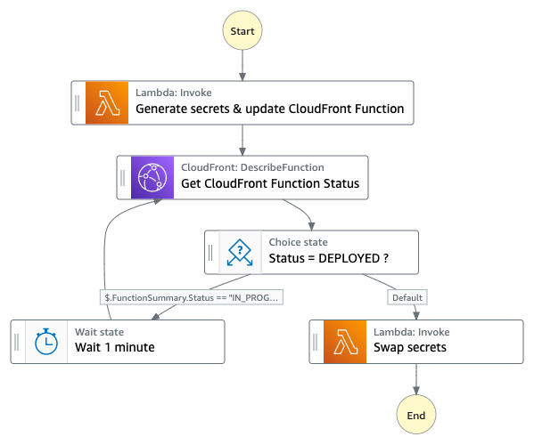
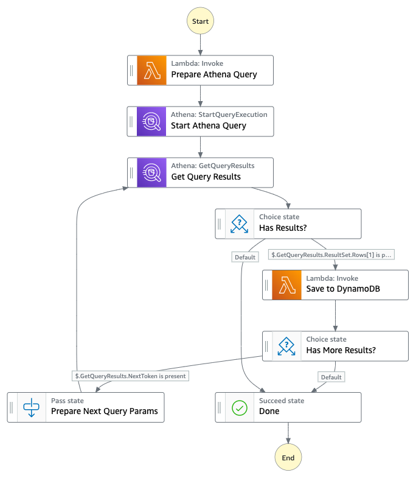

# Secure media stream delivery

AWS Solutions Implementation for Secure Media Stream Delivery at
the Edge, served by Amazon CloudFront CDN.

Customers can deploy the solution to protect their video stream
from unauthorize access by adding a cookieless tokenization embedded in the URL path.

Current version: **1.0.0**

## 🔰 Description

The Secure media stream delivery solution is a configurable and modular [AWS CDK](https://docs.aws.amazon.com/cdk/latest/guide/home.html) project. It can conditionally upon selection using the Wizard enable the deployment of the following components:

- Base module
- Automatic session invalidation
- APIs
- Demo website

## 📘 Architecture

Below is the architecture diagram.

<div align="center">
  
  <div align="center"><sub>Secure media stream delivery (click to enlarge)</sub></div>
</div>

#### **Rotate Secrets**

<div align="center">
  
  <div align="center"><sub>Rotate secrets (click to enlarge)</sub></div>
</div>

#### **Automatic session invalidation**

<div align="center">
  
  <div align="center"><sub>Automatic session invalidation (click to enlarge)</sub></div>
</div>

## 🚀 Tutorial

Before getting started, verify that your configuration matches the [list of requirements](#-requirements). 

## Deployment
The solution can be deployed through the CloudFormation template available on the solution [home page](https://aws.amazon.com/solutions/implementations/live-streaming-on-aws/).

## Creating a custom build

### Prerequisites:
* [AWS Command Line Interface](https://aws.amazon.com/cli/)
* Node.js 12.x or later
* AWS CDK 2.24.1

The are 2 options for deploying the solution: using the CDK deployment tools or running the build script to generate a CFN template and the packaged lambda code.

### Options 1: Deploying through the CDK.
This options simply flollows the standard CDK deployment process. You will need to run `cdk bootstrap` before you run cdk deploy the first time to setup the cdk resource in your AWS account. Details on using the CDK can be found [here].

#### 1. Clone the repo.


#### 2. Install the dependencies of the project to make it ready to use. To do so, simply run the below command.

  ```bash
  cd source
  ./install_dependencies.sh
  ```

#### 3. Run the built-in wizard which will prompt you with questions about the modules to deploy


  ```bash
  npm run wizard
  ```

The wizard will then generate a configuration in the `solution.context.json` file that is at the root of this repository. 


#### 4. Ensure that the AWS CDK has been bootsrapped on the target account, this is typically the case if you have never used AWS CDK before on the account.

```bash
npx cdk bootstrap
```

  > You only need to bootstrap the target account once, you can then dismiss this step. If you're planning on using multiple regions, the bootstrap process must be done for each AWS region.

#### 5. Deploy the solution using the following command.

```bash
npx cdk deploy --all
```


### Option 2: Generate a CloudFormation template.
The CloudFormation template (generated by the CDK) includes a lambda backed custom resource to configure MediaLive and create a UUID. To launch the solution the Lambda source code has to be deployed to an Amazon S3 bucket in the region you intend to deploy the solution. 

#### 1. Clone the repo
Download or clone the repo and make the required changes to the source code.

#### 2. Running unit tests for customization
Run unit tests to make sure added customization passes the tests:
```
cd ./deployment
chmod +x ./run-unit-tests.sh && ./run-unit-tests.sh
```

#### 3. Create an Amazon S3 Bucket
The CloudFormation template is configured to pull the Lambda deployment packages from Amazon S3 bucket in the region the template is being launched in. Create a bucket in the desired region with the region name appended to the name of the bucket. eg: for us-east-1 create a bucket named: `my-bucket-us-east-1`
```
aws s3 mb s3://my-bucket-us-east-1
```

Ensure that you are owner of the AWS S3 bucket. 
```
aws s3api head-bucket --bucket my-bucket-us-east-1 --expected-bucket-owner YOUR-AWS-ACCOUNT-NUMBER
```

#### 4. Create the deployment packages
Build the distributable:
```
chmod +x ./build-s3-dist.sh
./build-s3-dist.sh <my-bucket> secure-media-delivery-at-the-edge <version>
```

> **Notes**: The _build-s3-dist_ script expects the bucket name as one of its parameters. This value should not have the region suffix (remove the -us-east-1)

Deploy the distributable to the Amazon S3 bucket in your account:
```
aws s3 sync ./regional-s3-assets/ s3://my-bucket-us-east-1/secure-media-delivery-at-the-edge/<version>/ 
aws s3 sync ./global-s3-assets/ s3://my-bucket-us-east-1/secure-media-delivery-at-the-edge/<version>/ 
```

#### 5. Launch the CloudFormation template.
* Get the link of the VIDEOSTREAM.template uploaded to your Amazon S3 bucket.
* Deploy the solution.

## License

* This project is licensed under the terms of the Apache 2.0 license. See here `LICENSE`.

This solution collects anonymous operational metrics to help AWS improve the
quality of features of the solution. For more information, including how to disable
this capability, please see the [implementation guide](https://docs.aws.amazon.com/solutions/latest/live-streaming/welcome.html).

## 📊 Information

The below information displays approximate values associated with deploying and using this stack.

Metric | Value
------ | ------
**Deployment Time** | 5-10 minutes (depending on the selected options)
**CDK Version** | 2.24.1

## 🎒 Requirements

- An AWS Account ([How to create an AWS account](https://aws.amazon.com/premiumsupport/knowledge-center/create-and-activate-aws-account/?nc1=h_ls) | [How to create an AWS Organization account](https://docs.aws.amazon.com/organizations/latest/userguide/orgs_manage_accounts_create.html))
- [Node JS 12+](https://nodejs.org/en/) must be installed on the deployment machine. ([Instructions](https://nodejs.org/en/download/))
- The [AWS CDK 2.24.1](https://aws.amazon.com/en/cdk/) must be installed on the deployment machine. ([Instructions](https://docs.aws.amazon.com/cdk/latest/guide/getting_started.html))


