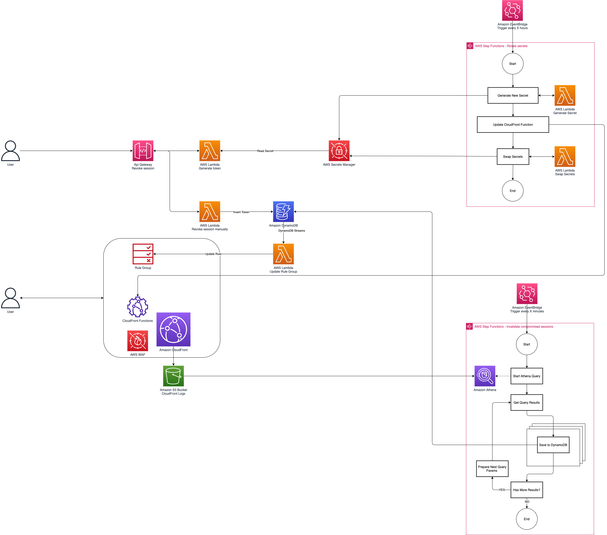

# Secure media stream delivery

AWS Solutions Implementation for Secure Media Stream Delivery at
the Edge, served by Amazon CloudFront CDN.

Customers can deploy the solution to protect their video stream
from unauthorize access by adding a cookieless tokenization embedded in the URL path.

Current version: **1.0.0**

## 📋 Table of content

- [Tutorial](#-tutorial)
- [Information](#-information)
- [Requirements](#-requirements)
- [Description](#-description)
- [Architecture](#-architecture)
- [See Also](#-see-also)

## 🚀 Tutorial

Before getting started, verify that your configuration matches the [list of requirements](#-requirements) for the Prototype Engagement Pack. Once done, simply open this project on your computer using your terminal.

You first need to install the dependencies of the project to make it ready to use. To do so, simply run the below command.

```bash
npm install
```

You then run the built-in wizard which will prompt you with questions on the type of configuration you would like to apply to the sandobox environment ([More information on CDK bootstrapping](https://docs.aws.amazon.com/cdk/latest/guide/cli.html#cli-bootstrap)).

```bash
npm run wizard
```

The wizard will then generate a configuration in the `prototype.context.json` file that is at the root of this repository. You will first need to ensure that the AWS CDK has been boostrapped on the target account, this is typically the case if you have never used AWS CDK before on the account.

```bash
npx cdk bootstrap
```

> You only need to bootstrap the target account once, you can then dismiss this step. If you're planning on using multiple regions, the boostrap process must be done for each AWS region.

Once the sandbox account has been bootstrapped, you can deploy the Prototype Engagement Pack using the following command.

```bash
npx cdk deploy
```

> AWS CDK will create and deploy a CloudFormation template on the sandbox account which you can view in the [CloudFormation console](https://console.aws.amazon.com/cloudformation/home) in the selected region.

Whenever the prototype comes to an end, you need to remove the Prototype Engagement Pack from the sandbox account and all the resources it has deployed on the account. To do so, you use the following command which will destroy the associated CloudFormation stack.

```bash
npx cdk destroy
```

## 📊 Information

The below information displays approximate values associated with deploying and using this stack.

Metric | Value
------ | ------
**Deployment Time** | 1-5 minutes (depending on the selected options)
**CDK Version** | 2.14.0

## 🎒 Requirements

- An AWS Account ([How to create an AWS account](https://aws.amazon.com/premiumsupport/knowledge-center/create-and-activate-aws-account/?nc1=h_ls) | [How to create an AWS Organization account](https://docs.aws.amazon.com/organizations/latest/userguide/orgs_manage_accounts_create.html))
- [Node JS 12+](https://nodejs.org/en/) must be installed on the deployment machine. ([Instructions](https://nodejs.org/en/download/))
- The [AWS CDK CLI](https://aws.amazon.com/en/cdk/) must be installed on the deployment machine. ([Instructions](https://docs.aws.amazon.com/cdk/latest/guide/getting_started.html))

## 🔰 Description

The Secure media stream delivery solution is a configurable and modular [AWS CDK](https://docs.aws.amazon.com/cdk/latest/guide/home.html) project. It can conditionally upon selection using the Wizard enable the deployment of the following components:

- Session invalidation
- REST Apis

## 📘 Architecture

Below is the architecture diagram describing the resources that the Prototype Engagement Pack can create depending on the selected options.

<div align="center">
  
  <div align="center"><sub>Secure media stream delivery (click to enlarge)</sub></div>
</div>
